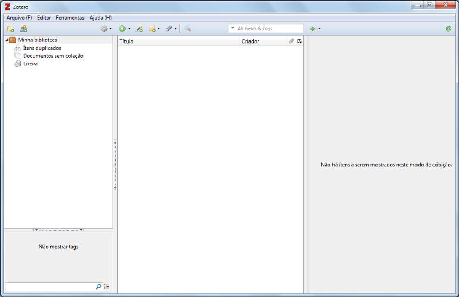

# Zotero: *uma* solução para gerenciamento de referências bibliográficas 

Há diversos softwares que podem ser utilizados no processo de automação de
referências bibliográficas, são os chamados PGRB - Programa Gerenciador de Referências
Bibliográficas4. Mas, há alguns fatores que devem ser observados durante o
processo de escolha, dentre eles a opção pelo Software Livre uma vez que o Governo
Federal Brasileiro indica sua utilização em instituições públicas. Além disso, de acordo
com Correia:

> As principais características que reforçam a utilização do Zotero são a facilidade
> de uso, o acesso e o compartilhamento de informação de forma online e a
> utilização do estilo de citação ABNT (NBR 6023) (CORREIA, 2012, p. p.197).

Em nosso caso específico, procuramos uma solução que nos permitisse ter acesso
ao Banco de Dados interno do software, de modo que os dados em sua forma bruta
pudessem ser acessados e transferidos para o SmCube.Hub, onde poderiam ser tratados
para se adequarem ao formato necessário à aplicação do MSM. Por se tratar de um
software estável, livre e de código aberto, o Zotero se apresentou como o mais adequado.
Há também outro fator fundamental. Ainda que na maioria das vezes o Zotero seja
utilizado apenas como um gerenciador de referências bibliográficas, o que já representa
um grande avanço em termos de ganho de agilidade no contexto da pesquisa acadêmica,
ele também pode ser utilizado para auxiliar pesquisas qualitativas uma vez que permite
o armazenamento de fichamentos, arquivos de áudio, vídeo, pdf, e outros, além da
marcação de textos. Ainda assim, de acordo com pesquisas bibliográficas realizadas, é
possível constatar que esta possibilidade ainda é muito pouco explorada pelos usuários
do Zotero. 

Aliás, de modo geral, de acordo com Correia, verifica-se que "existe pouca
literatura sobre os PGRB, tanto em nível nacional quanto em nível internacional, daí a
necessidade de mais estudos quanto a essa temática"(CORREIA, 2012, p. p.197). Por
este motivo, apresentaremos na sequência mais informação sobre a utilização do Zotero
como gerenciador de referências bibliográficas no contexto da construção de banco de
dados para apoio à pesquisa qualitativa, apresentando também como especificidades
do MSM podem nele ser aplicadas.

Mais abaixo está a tela principal do Zotero. Na parte superior está o menu principal
e, logo abaixo, a barra de opções que apresenta ícones das opções mais utilizadas
para que o trabalho fique mais rápido. No canto superior esquerdo, está a janela que
contém a biblioteca, nela estão os nomes das coleções locais - que ficam gravadas apenas
no computador local, e grupos de colaboração na nuvem - neste caso os dados também
são armazenados localmente, mas podem ser acessados por outros pesquisadores e são
atualizados todas as vezes que uma sincronização é realizada fazendo com que todo o
grupo tenha acesso às mesmas informações. Ainda no canto esquerdo, mas na parte
inferior, são apresentados os marcadores (tag’s), que serão tratados pelo SmCube.Hub
como fatores. Na janela central, são apresentadas informações das referências, como título
do item, autor, data, etc. (os dados que aparecem podem ser configurados). Quando
uma referência é selecionada, as informações específicas aparecem na janela da direita,
como título da referência, seu tipo, número de páginas, data de publicação, endereço
na web, etc. Além disso, é possível ter acesso às notas pessoais, marcadores e itens
relacionados. 

Enfim, o Zotero apresenta uma interface bem simples  e que consegue reunir de forma bem clara todas as informações bibliográficas necessárias. Também é possível incluir várias bibliotecas, com pastas e subpastas, inserir diversos marcadores, até mesmo destacando alguns com cores específicas, trazendo organização e facilidade de acesso até mesmo para grandes coleções6.

